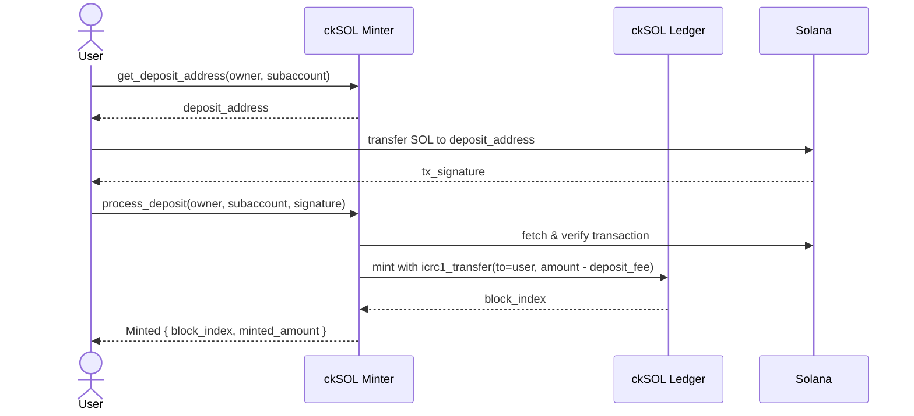
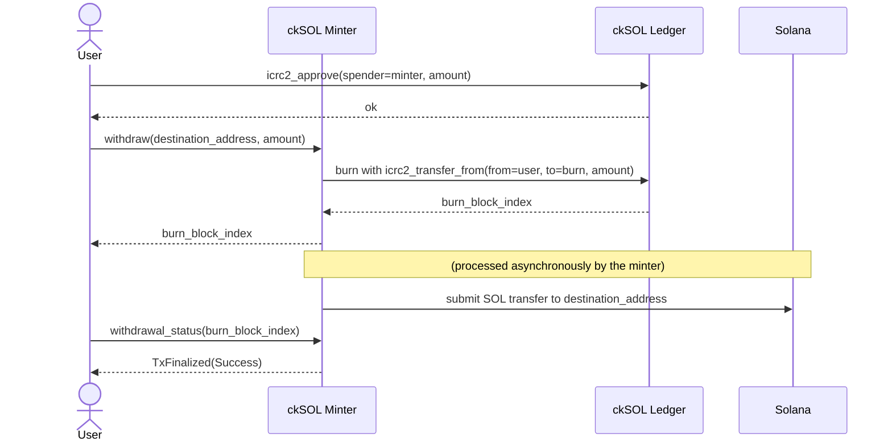
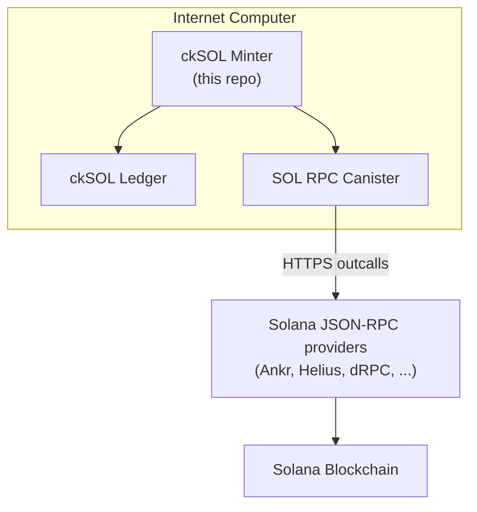

[](https://github.com/dfinity/cksol/actions/workflows/ci.yml)
[](LICENSE)
[](https://www.rust-lang.org/)
[](https://solana.com/)
[](https://internetcomputer.org/)

# ckSOL

> [!IMPORTANT]
> The ckSOL minter is under active development and subject to change. Access to the repository has been opened to allow for early feedback. Check back regularly for updates.


ckSOL is a [chain-key token](https://internetcomputer.org/how-it-works/chain-key-tokens/) on the [Internet Computer](https://internetcomputer.org/) that is backed 1:1 by SOL, the native token of the [Solana](https://solana.com/) blockchain.

Each ckSOL is backed by exactly 1 SOL held by the ckSOL minter canister. ckSOL can be converted to SOL at any time, and vice versa.

## Table of Contents

- [How It Works](#how-it-works)
  - [Deposit: SOL → ckSOL](#deposit-sol--cksol)
  - [Withdrawal: ckSOL → SOL](#withdrawal-cksol--sol)
- [Architecture](#architecture)
- [Deployment](#deployment)
- [Interacting via the CLI](#interacting-via-the-cli)
- [Repository Structure](#repository-structure)
- [Development](#development)
  - [Prerequisites](#prerequisites)
  - [Building](#building)
  - [Testing](#testing)
- [Related Projects](#related-projects)
- [Contributing](#contributing)
- [License](#license)

<a id="how-it-works"></a>
## ⚙️ How It Works

The ckSOL minter canister is the core component of the system. It manages the conversion between SOL and ckSOL, maintains custody of the SOL backing all outstanding ckSOL tokens, and interacts with the Solana blockchain via the [SOL RPC canister](https://github.com/dfinity/sol-rpc-canister).

The ckSOL token itself is implemented as an [ICRC-1/ICRC-2](https://github.com/dfinity/ICRC-1) ledger canister.

The minter controls one or more Solana addresses derived from a [threshold Schnorr over Ed25519](https://internetcomputer.org/docs/references/ic-interface-spec#ic-sign-with-schnorr) public key and a per-account derivation path. No private key ever exists in plaintext — Solana transactions are signed via the IC management canister's `sign_with_schnorr` API (`SchnorrAlgorithm::Ed25519`).

### Deposit: SOL → ckSOL

1. **Get a deposit address.** Call `get_deposit_address` on the minter with your ICP principal (and an optional subaccount). The minter returns a Solana address derived specifically for your account.

2. **Send SOL.** Transfer SOL to that deposit address from any Solana wallet.

3. **Notify the minter.** Call `process_deposit` on the minter with the Solana transaction signature and the same owner/subaccount used in step 1. This call requires attaching cycles (see `deposit_sol_required_cycles` in `get_minter_info`). The minter:
   - Fetches the transaction from Solana via the SOL RPC canister.
   - Verifies it is a valid transfer to your deposit address.
   - Mints the corresponding amount of ckSOL (minus the deposit fee) to your ICRC-1 ledger account.

4. **Consolidation.** The minter periodically consolidates funds from individual deposit addresses into its main Solana account.



### Withdrawal: ckSOL → SOL

1. **Approve the minter.** Grant the minter an [ICRC-2](https://github.com/dfinity/ICRC-1/blob/main/standards/ICRC-2/README.md) allowance on your ckSOL ledger account.

2. **Submit a withdrawal request.** Call `withdraw` on the minter with the destination Solana address and the amount in [lamports](https://solana.com/docs/terminology#lamport). The minter:
   - Burns the requested ckSOL from your ledger account via [icrc2_transfer_from](https://github.com/dfinity/ICRC-1/blob/main/standards/ICRC-2/README.md#icrc2_transfer_from).
   - Queues the corresponding SOL transfer.

3. **Transaction submission.** The minter constructs a Solana transaction, signs it using chain-key Ed25519, and submits it via the SOL RPC canister.

4. **Monitor status.** Call `withdrawal_status` with the ledger burn index returned by `withdraw` to track the status of your withdrawal request (`Pending` → `TxSent` → `TxFinalized`).



<a id="architecture"></a>
## 🏗️ Architecture



The full design rationale, including fees and flows, is in the [design document](docs/design.md).

**ckSOL Minter** — The main canister in this repository. It manages the deposit and withdrawal lifecycle, holds custody of SOL via chain-key addresses, signs Solana transactions using threshold Schnorr over Ed25519, and interacts with the ckSOL ledger.

**ckSOL Ledger** — A standard [ICRC-1/ICRC-2](https://github.com/dfinity/ICRC-1) ledger canister. It tracks ckSOL balances and processes mints and burns as instructed by the minter.

**SOL RPC Canister** — A shared infrastructure canister on the Internet Computer that relays Solana JSON-RPC calls to multiple providers via HTTPS outcalls and aggregates their responses. See the [SOL RPC canister repository](https://github.com/dfinity/sol-rpc-canister) for details.

<a id="deployment"></a>
## 🚀 Deployment

###  ckDevnetSOL — 🧪 Staging (Solana Devnet)

| Canister | Canister ID |
|----------|-------------|
| Minter | [`ljyxk-riaaa-aaaar-qb5mq-cai`](https://dashboard.internetcomputer.org/canister/ljyxk-riaaa-aaaar-qb5mq-cai) |
| Ledger | [`la34w-haaaa-aaaar-qb5na-cai`](https://dashboard.internetcomputer.org/canister/la34w-haaaa-aaaar-qb5na-cai) |

###  ckSOL — 🚀 Production (Solana Mainnet)

| Canister | Canister ID |
|----------|-------------|
| Minter | `lh22c-kyaaa-aaaar-qb5nq-cai` *(not yet deployed)* |
| Ledger | `ls5lp-lqaaa-aaaar-qb5oa-cai` *(not yet deployed)* |

<a id="interacting-via-the-cli"></a>
## 💻 Interacting via the CLI

You can interact with the ckSOL minter using [`icp-cli`](https://github.com/dfinity/icp-cli). Pass `-e prod` (or `-e staging`) to target the corresponding environment defined in `icp.yaml`.

### Get minter info

Query fees, minimum amounts, and the current minter balance:

```sh
icp canister call -e prod cksol_minter get_minter_info '()'
```

### Get your deposit address

Returns the Solana address you should send SOL to in order to deposit. When `owner` is `null`, it defaults to your calling identity's principal:

```sh
icp canister call -e prod cksol_minter get_deposit_address \
  '(record { owner = null; subaccount = null })' --query
```

### Notify the minter of a deposit

After sending SOL to your deposit address, call `process_deposit` with the Solana transaction signature to trigger minting. Pass the same `owner`/`subaccount` used when calling `get_deposit_address` — when `owner` is `null`, it defaults to your calling identity's principal. Replace `<SIGNATURE>` with the base-58 encoded transaction signature.

> [!NOTE]
> This call requires attaching cycles — check the required amount via `get_minter_info` (`deposit_sol_required_cycles` field). If your identity does not hold cycles directly, you can [convert ICP to cycles](https://cli.internetcomputer.org/0.2/guides/tokens-and-cycles/#converting-icp-to-cycles) first, or route the call through a proxy canister using `--proxy <proxy-principal> --cycles <amount>`.

```sh
icp canister call -e prod cksol_minter process_deposit \
  '(record { owner = null; subaccount = null; signature = "<SIGNATURE>" })'
```

A successful response looks like:

```
(variant { Ok = variant { Minted = record { block_index = 42; minted_amount = 990_000_000; deposit_id = ... } } })
```

### Submit a withdrawal request

Burns ckSOL from your ledger account and initiates a transfer of the equivalent SOL to the given Solana address. Replace `<SOLANA_ADDRESS>` with the destination address and `<AMOUNT>` with the amount in lamports. The optional `from_subaccount` field defaults to `null` (the default subaccount):

```sh
icp canister call -e prod cksol_minter withdraw \
  '(record { address = "<SOLANA_ADDRESS>"; amount = <AMOUNT>; from_subaccount = null })'
```

A successful response returns the burn block index, which you can use to track the withdrawal:

```
(variant { Ok = record { block_index = 42 } })
```

### Check a withdrawal status

After calling `withdraw`, track the status using the `block_index` returned in the response:

```sh
icp canister call -e prod cksol_minter withdrawal_status \
  '(record { block_index = 42 })'
```

<a id="repository-structure"></a>
## 📁 Repository Structure

```
.
├── minter/                  # ckSOL minter canister
│   ├── src/
│   │   ├── address/         # Deposit address derivation
│   │   ├── consolidate/     # Deposit consolidation logic
│   │   ├── dashboard/       # HTTP dashboard
│   │   ├── lifecycle.rs     # Canister init/upgrade and event log
│   │   ├── metrics.rs       # Prometheus metrics
│   │   ├── monitor/         # Transaction monitoring
│   │   ├── state/           # Minter state and event sourcing
│   │   ├── deposit/manual/  # Manual deposit processing
│   │   ├── withdraw/        # Withdrawal processing
│   │   └── ...
│   └── cksol_minter.did     # Candid interface
├── libs/
│   ├── types/               # Public ckSOL types (cksol-types crate)
│   └── types-internal/      # Internal types and event definitions
├── integration_tests/       # End-to-end tests using PocketIC
├── docs/
│   └── design.md            # Design document
└── scripts/
    └── build                # Build script for the minter Wasm
```

<a id="development"></a>
## 🛠️ Development

### Prerequisites

Install [`mise`](https://mise.jdx.dev/) and then provision the pinned toolchain
(Rust with the `wasm32-unknown-unknown` target, `cargo-sort`,
[`ic-wasm`](https://github.com/dfinity/ic-wasm), `cargo-llvm-cov` and `jq`):

```sh
mise install
```

Tool versions are defined in [`mise.toml`](./mise.toml) and their download
checksums in [`mise.lock`](./mise.lock), so local, CI and the reproducible
Docker build stay in sync.

`canbench` is kept out of that set, because only the benchmarks need it and
building it from source costs about two minutes. It lives in
[`mise.bench.toml`](./mise.bench.toml) instead, which mise loads only for the
`bench` environment:

```sh
MISE_ENV=bench mise install
```

> [!NOTE]
> Upstream publishes a single Linux x86-64 `canbench` binary, and mise offers it
> for every platform. On macOS or Windows that binary will install but not run,
> so build it from source instead: `cargo install --locked canbench`.

Additionally:

- `gzip` — used by `./scripts/build` to compress the output Wasm.

### Building

Build the minter Wasm:

```sh
./scripts/build --cksol_minter
```

The resulting `cksol_minter.wasm.gz` will be written to the `wasms/` directory.

You can also build the Rust workspace directly (without Wasm post-processing):

```sh
cargo build
```

### Testing

The test suite has two parts:

**Unit tests** — no external dependencies:

```sh
cargo test --lib
```

**PocketIC integration tests** — require the minter Wasm, which is read from `wasms/cksol_minter.wasm.gz` (written by both `./scripts/docker-build` and `./scripts/build --cksol_minter`), unless the `CKSOL_MINTER_WASM_PATH` environment variable points to it:

```sh
./scripts/build --cksol_minter
cargo test -p cksol-int-tests --test tests
```

**Solana validator integration tests** — require the [Solana CLI](https://solana.com/docs/intro/installation) to be installed, so that each test can start its own `solana-test-validator`:

```sh
cargo test -p cksol-int-tests --test solana_test_validator
```

> [!CAUTION]
> Running `cargo test` without arguments will attempt all tests, including the Solana validator suite, and will fail if the Solana CLI is not installed.

**Coverage** — measures the unit tests only, since the integration tests drive a prebuilt Wasm that host instrumentation cannot observe:

```sh
./scripts/coverage
```

This writes `coverage/`, including a browsable report at `coverage/html/index.html`. CI runs the same script and publishes the summary and the report as a build artifact.

<a id="related-projects"></a>
## 🔗 Related Projects

- [SOL RPC Canister](https://github.com/dfinity/sol-rpc-canister) — Solana JSON-RPC access from the Internet Computer.
- [ckETH](https://github.com/dfinity/ic/tree/master/rs/ethereum/cketh) — Chain-key Ethereum token, which ckSOL is modeled after.
- [ckBTC](https://github.com/dfinity/ic/tree/master/rs/bitcoin/ckbtc) — Chain-key Bitcoin token.
- [ICRC-1 Ledger](https://github.com/dfinity/ICRC-1) — The token standard used by the ckSOL ledger.

<a id="contributing"></a>
## 🤝 Contributing

At this point we do not accept external contributions yet. External contributions will be accepted after the initial release.

<a id="license"></a>
## 📄 License

This project is licensed under the [Apache License 2.0](LICENSE).
